<p align="center">
  
</p>

# SinhSafe: A Deep Learning Approach to Sinhala Harassment Detection

#### Team
- E20397, Thilakasiri P.D., [email](mailto:e20397@eng.pdn.ac.lk)

#### Supervisors
- Dr. Eng. Sampath Deegalla, [email](mailto:sampath@eng.pdn.ac.lk)
- Dr. Eng. Damayanthi Herath, [email](mailto:damayanthiherath@eng.pdn.ac.lk)

---

## Project Summary
SinhSafe is a content moderation framework built for the linguistic complexities of Sinhala and code-mixed Singlish. Traditional moderation tools often fail on local languages due to the **semantic gap** — the difficulty in distinguishing general vulgarity (**Offensive**) and targeted, malicious content (**Harassment**) from ordinary colloquial speech (**Normal**).

For this submission, we built a **ternary classifier** — Normal / Offensive / Harassment — on **6,075** documents sourced from SOLD (Ranasinghe et al., 2022), validated using three independent annotators, inter-annotator agreement (IAA), and majority voting. Traditional ML baselines were capped at **~65% macro F1**, so we benchmarked three deep learning architectures — **XLM-RoBERTa Large**, **SinBERT**, and **SinLLaMA-8B** — and combined the two best-performing encoders (XLM-RoBERTa + SinBERT) in a **soft-voting ensemble**, reaching **76.21% macro F1** on the held-out test set — though, notably, not a *statistically significant* improvement over standalone XLM-RoBERTa (see Results).

Beyond this submission's scope, we are extending the work with a 3-model ensemble pseudo-labeling engine to grow the dataset — see [Additional / Ongoing Work](#additional--ongoing-work-v2-pseudo-labeling-extension) below.

---

## Methodology & The Data Engine

### 1. The Data Pipeline
* **Noise Removal:** Custom scripts to strip handles (e.g., `@user`) and social media artifacts.
* **Transliteration:** Singlish → Sinhala conversion via the Google Translate API.
* **Manual Annotation:** Three independent annotators labeled every document against a "Normal / Offensive / Harassment" rule set; inter-annotator agreement (IAA) was measured, and majority voting resolved disagreements.
* **Split:** Stratified 90% train / 10% held-out test, random state fixed at 42 for reproducibility. Class distribution is imbalanced (~38% Normal, ~33% Offensive, ~28% Harassment as the minority class), so stratified sampling was preserved across every split and cross-validation fold.

### 2. Baseline Comparison
Before moving to deep learning, we evaluated the dataset against traditional algorithms:
* **Tested Models:** Naive Bayes, Linear SVM, Random Forest, Logistic Regression, and MLP.
* **The "F1 Ceiling":** All traditional models failed to exceed **~65% macro F1**, showing that semantic nuance in code-mixed text requires transformer-based architectures.

<p align="center">
  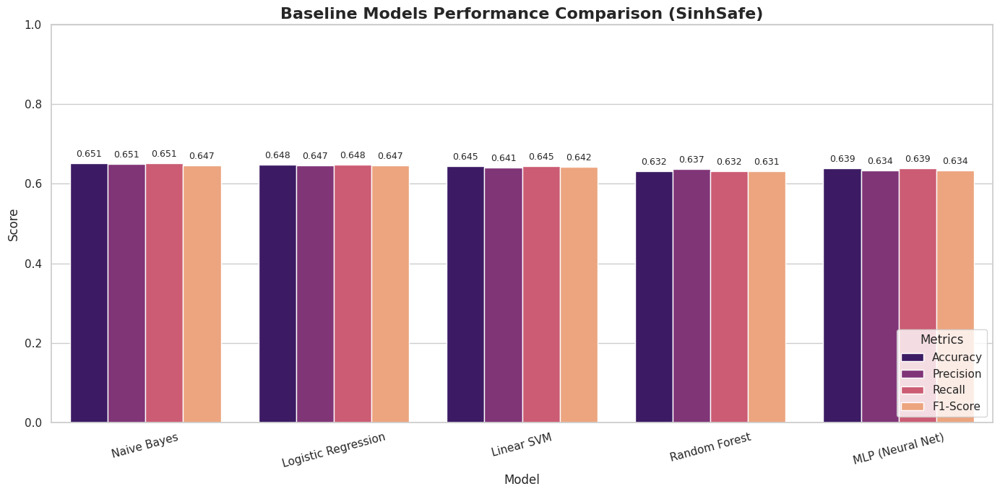
</p>

---

## Experiment Setup and Implementation

### 1. Model Architectures
Three architectures were engineered, each with custom layers to manage overfitting:

* **XLM-RoBERTa (Large, ~550M params):** Custom dense classification head with dropout and **GELU activation** over the pooled embedding.
* **SinBERT (~110M params, LSTM head):** Bi-directional LSTM head to capture long-range dependencies in native Sinhala script.
* **SinLLaMA-8B:** Instruction-tuned generative LLM using **4-bit NF4 quantization (QLoRA)** and LoRA adapters for parameter-efficient tuning, fine-tuned with Alpaca-style prompting.

> Implementation-level details (exact dropout %, LSTM unit count, pooling strategy) reflect the actual training code — confirm these against your scripts if they've changed since this was written; they aren't reported in the symposium slides and so weren't independently cross-checked here.

### 2. Training Strategies, Hyperparameter Search & Loss Analysis
To find the best training arguments (learning rate, batch size, weight decay) and prevent overfitting, we tested 12 distinct iterations across the three architectures, tracking training vs. evaluation loss for every version to select the best-fit checkpoint for the final ensemble.

#### A. SinBERT — 5 Versions Tested
Evaluated using stratified 5-fold cross-validation.

<table>
  <tr>
    <td align="center"><strong>Version 1</strong><br>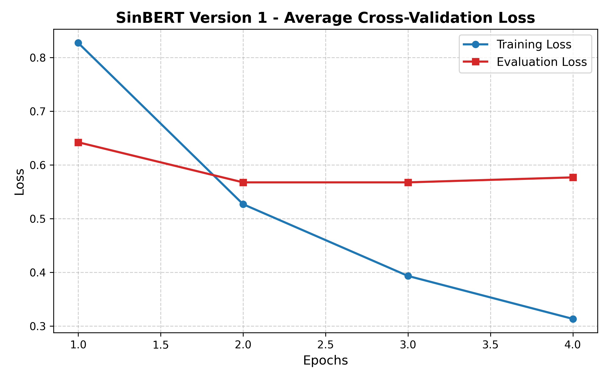</td>
    <td align="center"><strong>Version 2</strong><br>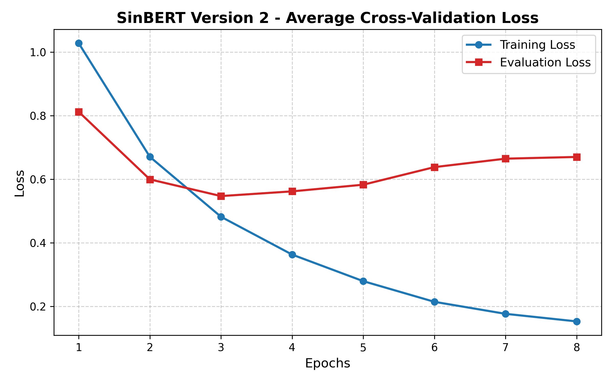</td>
  </tr>
  <tr>
    <td align="center"><strong>Version 3</strong><br>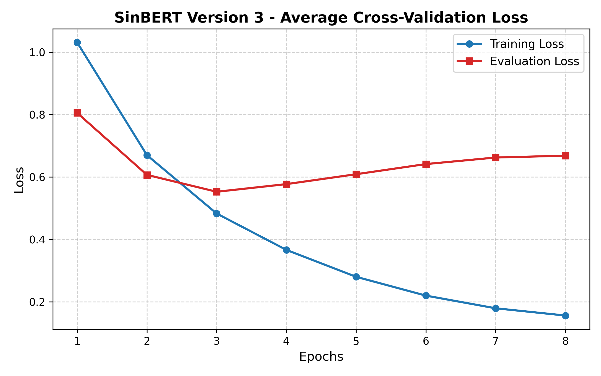</td>
    <td align="center"><strong>Version 4</strong><br>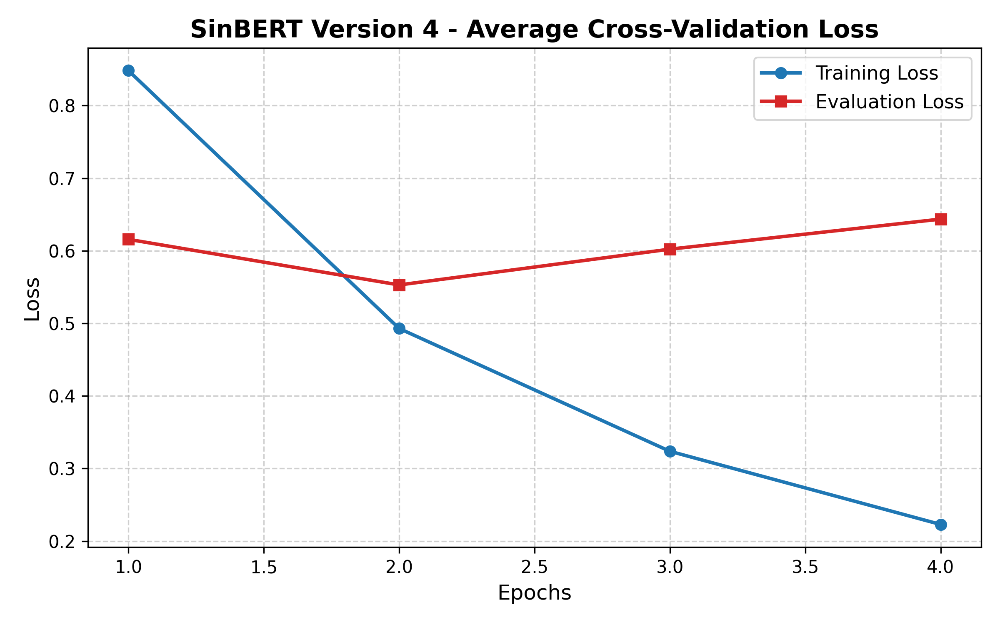</td>
  </tr>
  <tr>
    <td colspan="2" align="center"><strong>Version 5</strong><br>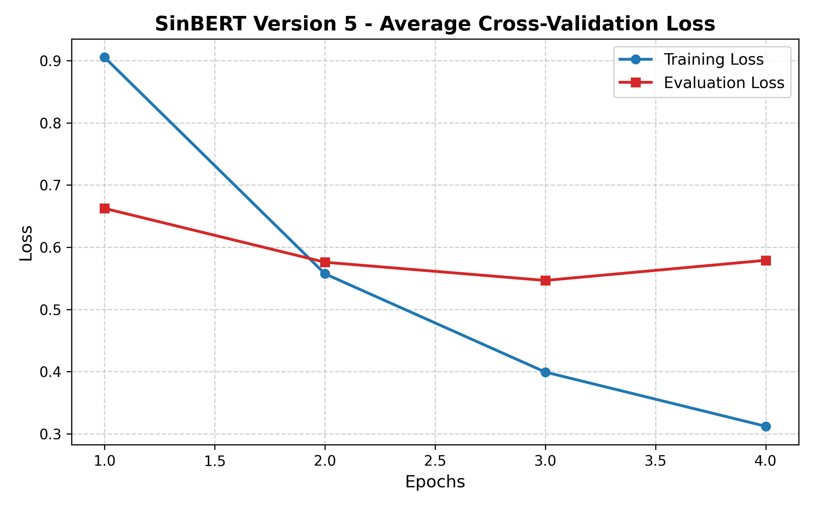</td>
  </tr>
</table>

**SinBERT Performance Comparison**
<p align="center">
  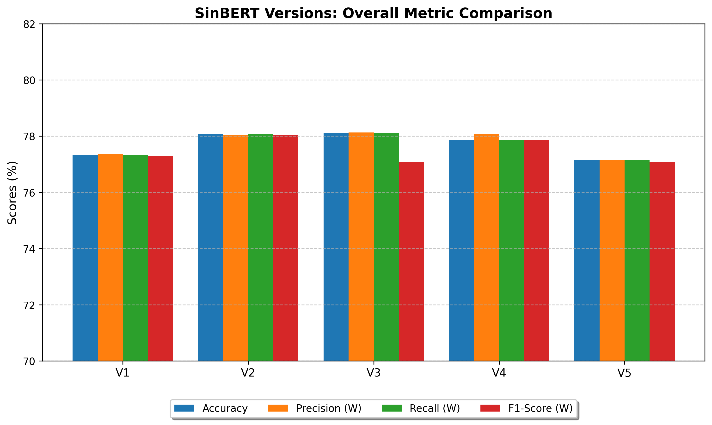
</p>

<h3 style="margin-top: 20px;">Rationale for Selecting Version 5</h3>

**Version 5** was selected as the optimal SinBERT configuration, reaching a validation macro F1 of **74.5%** — the highest of the five versions tested. Its loss curve showed evaluation loss hit its lowest point at **Epoch 3 (eval loss 0.547)**, just before the epoch-4 upturn (0.578) signaled the onset of overfitting. Halting training at this checkpoint captured the model at its peak generalization, ahead of the overfitting seen in later versions.

**🏆 Winning Parameters (SinBERT V5):**
```text
learning_rate : 2e-05
batch_size    : 32
weight_decay  : 0.01
```
*(epoch count, max sequence length, and dropout probability weren't part of the symposium's reported hyperparameter table — confirm these against your training logs before publishing.)*

#### B. XLM-RoBERTa (Large) — 3 Versions Tested
Evaluated using stratified 5-fold cross-validation.

<table>
  <tr>
    <td align="center"><strong>Version 1</strong><br>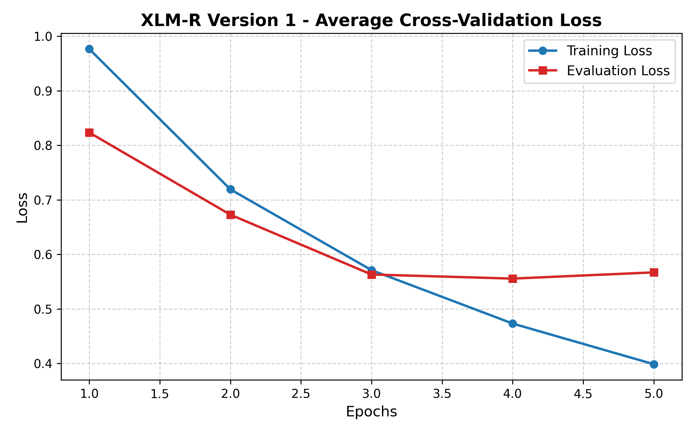</td>
    <td align="center"><strong>Version 2</strong><br>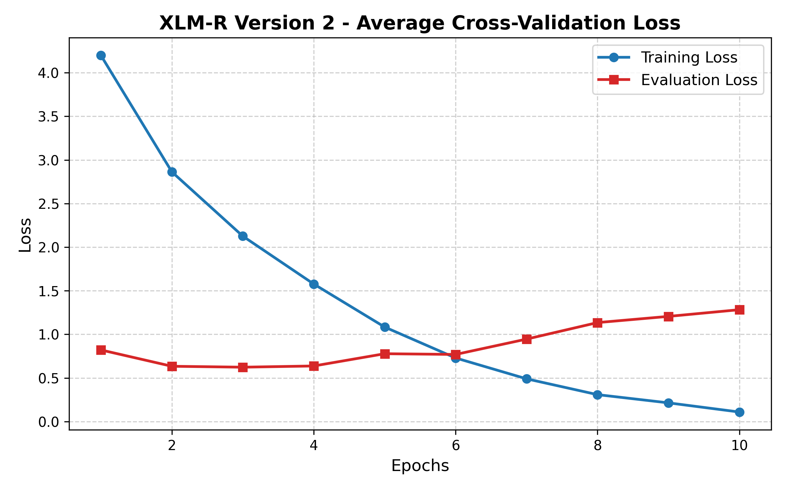</td>
  </tr>
  <tr>
    <td colspan="2" align="center"><strong>Version 3</strong><br>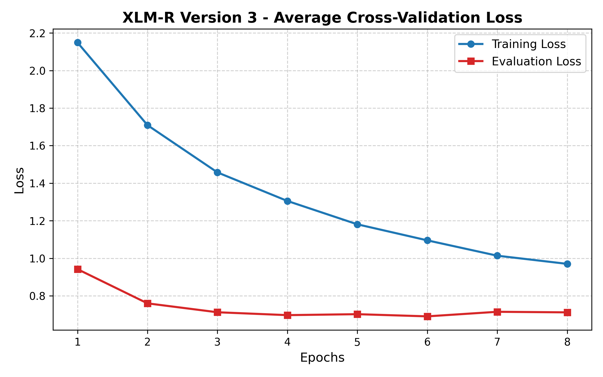</td>
  </tr>
</table>

**XLM-RoBERTa Performance Comparison**
<p align="center">
  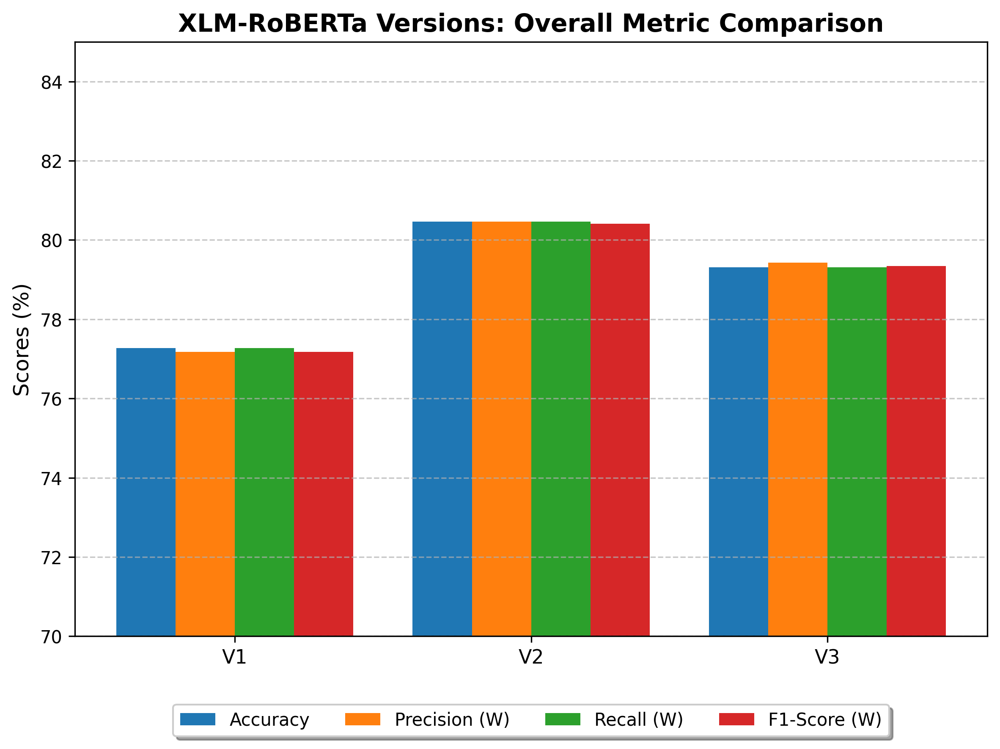
</p>

<h3 style="margin-top: 20px;">Rationale for Selecting Version 1</h3>

**Version 1** was selected as the production-ready XLM-RoBERTa configuration, achieving the highest validation macro F1 (**76.9%**) of the three versions tested. Its evaluation loss reached its lowest point at **Epoch 4 (eval loss 0.554)**, just before the epoch-5 upturn (0.567) indicated overfitting — early stopping captured the model at this optimal checkpoint.

**🏆 Winning Parameters (XLM-R V1):**
```text
learning_rate : 1e-05
batch_size    : 16
weight_decay  : 0.05
```
*(epoch count and warmup steps weren't part of the symposium's reported hyperparameter table — confirm against your training logs.)*

#### C. SinLLaMA-8B — 4 Versions Tested
Evaluated via an 80/10 split within the training partition (full cross-validation wasn't practical at 8B parameters). Early stopping halted training if evaluation loss increased for 3 consecutive intervals (every 50 steps), capturing the checkpoint with the lowest evaluation loss.

<table>
  <tr>
    <td align="center"><strong>Version 1</strong><br>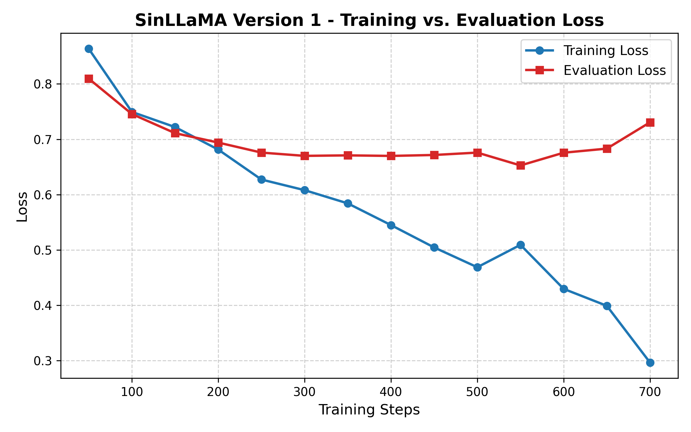</td>
    <td align="center"><strong>Version 2</strong><br>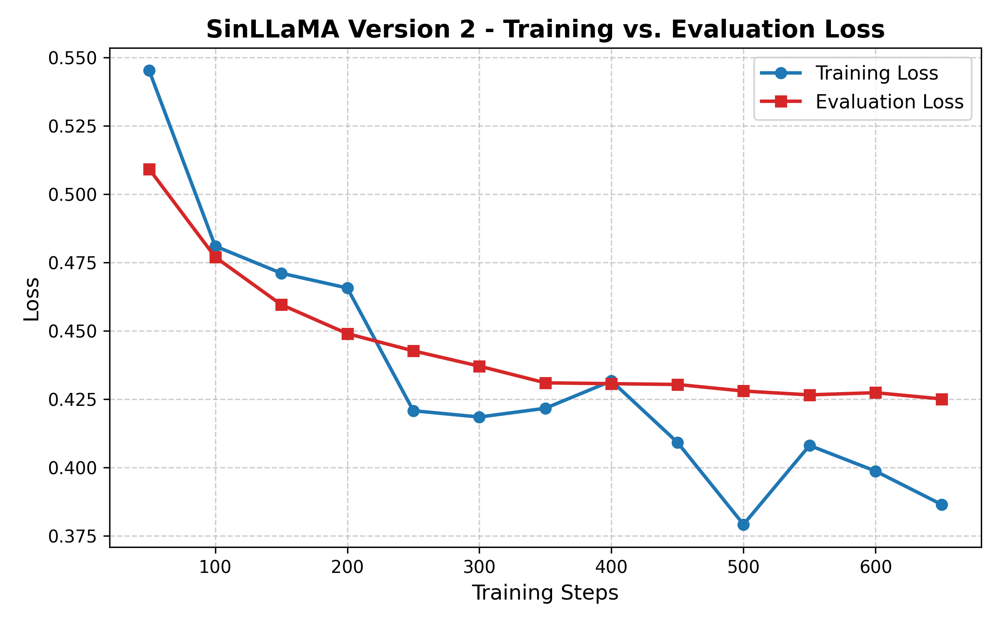</td>
  </tr>
  <tr>
    <td align="center"><strong>Version 3</strong><br>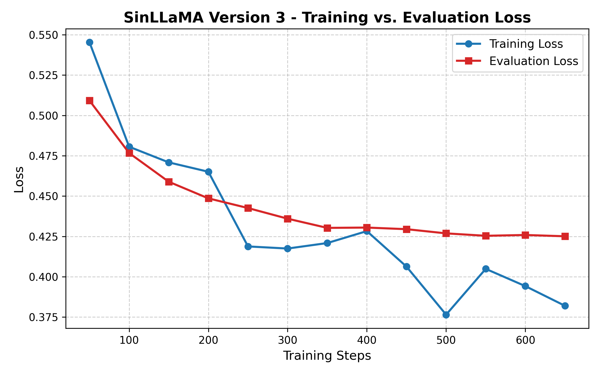</td>
    <td align="center"><strong>Version 4</strong><br>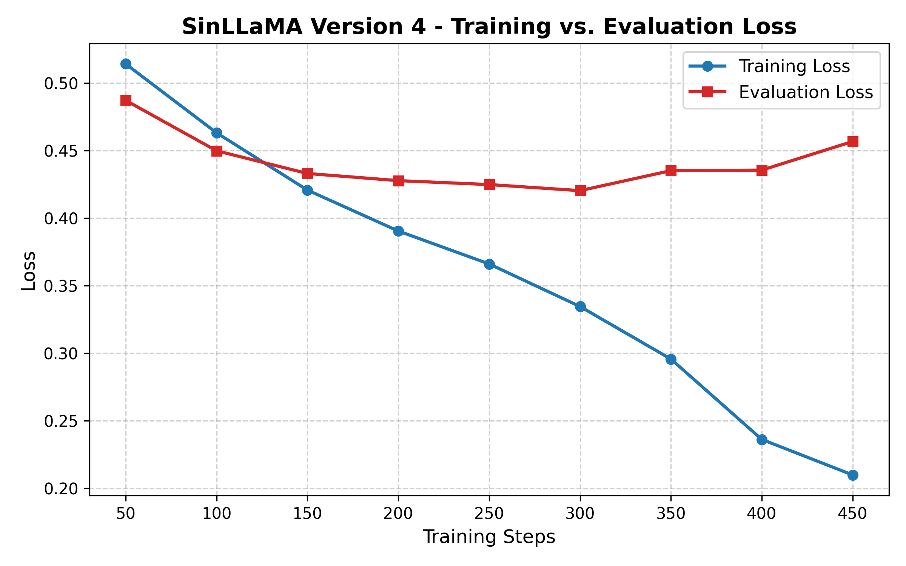</td>
  </tr>
</table>

**SinLLaMA Performance Comparison**
<p align="center">
  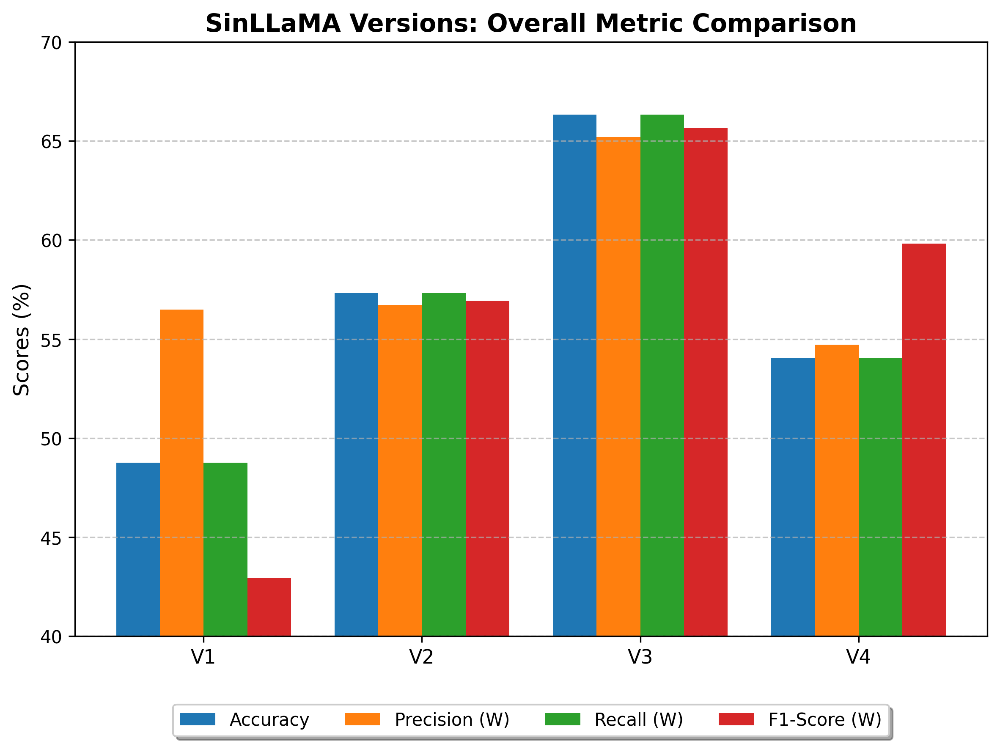
</p>

<h3 style="margin-top: 20px;">Rationale for Selecting Version 3</h3>

**Version 3** was selected as the optimal SinLLaMA configuration, reaching a validation macro F1 of **57.2%**. Despite the 8B-parameter model's high tendency to overfit — visible in the diverging loss curves of the other versions — Version 3's evaluation loss plateaued around **0.43 near step 400** while training loss kept falling: the clearest signature of the memorization trap. This checkpoint was retained as the best-available generative configuration, though on the final held-out test set it still only reached **55.7% macro F1**, well behind both encoder models.

**🏆 Winning Parameters (SinLLaMA V3):**
```text
max_length        : 512
batch_size        : 16
num_train_epochs  : 1
learning_rate     : 5e-05
weight_decay      : 0.05
bf16              : True
```

### 3. Synthesizing Production Models
After identifying the optimal hyperparameters and best-fit checkpoint for each architecture, we exited the cross-validation phase and retrained **XLM-RoBERTa**, **SinBERT**, and **SinLLaMA** on **100% of the 90% training partition** (holding out the same 10% test set used for every model throughout), using each architecture's winning parameters. This produced three inference-ready production models.

---

## Results and Analysis

Final scores are **macro F1** on the 10% held-out test set (best configs, trained on 100% of the 90% training partition):

| Model | Parameters | Validation Macro F1 (best version) | Test Macro F1 | 95% CI (bootstrap, 1,000 iterations) |
| :--- | :--- | :--- | :--- | :--- |
| SinBERT Large | ~110M | 74.5% (V5) | 73.44% | [69.83%, 77.02%] |
| XLM-RoBERTa Large | ~550M | 76.9% (V1) | 75.44% | [71.95%, 78.89%] |
| SinLLaMA-8B | ~8B | 57.2% (V3) | 55.7% | — |
| **SinhSafe Ensemble (soft-voting)** | — | — | **76.21%** | [72.96%, 79.66%] |

**Is the ensemble actually better?** The ensemble's advantage over standalone XLM-RoBERTa is only **+0.89 points** (95% CI: [-1.61%, 3.36%]) — the interval crosses zero, so this is **not statistically significant**. A well-tuned standalone XLM-RoBERTa performs comparably to the costlier ensemble.

<table>
  <tr>
    <td align="center"><strong>Production Models: Final Eval Loss</strong><br>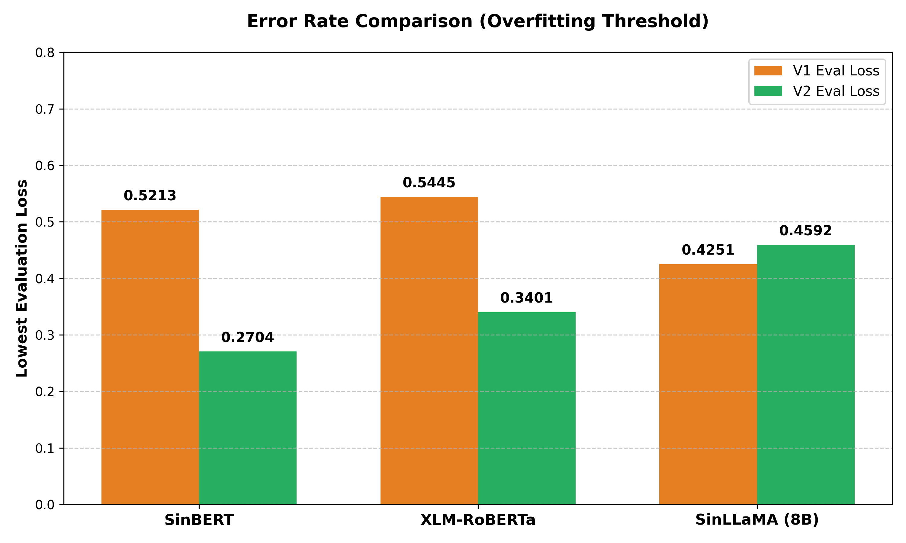</td>
  </tr>
</table>

### Optimal Epoch & Loss Curves
By tracking training and evaluation loss, we identified the best epoch to run each model's final training pass without overfitting or underfitting.

<table>
  <tr>
    <td align="center"><strong>SinBERT Production Model</strong><br>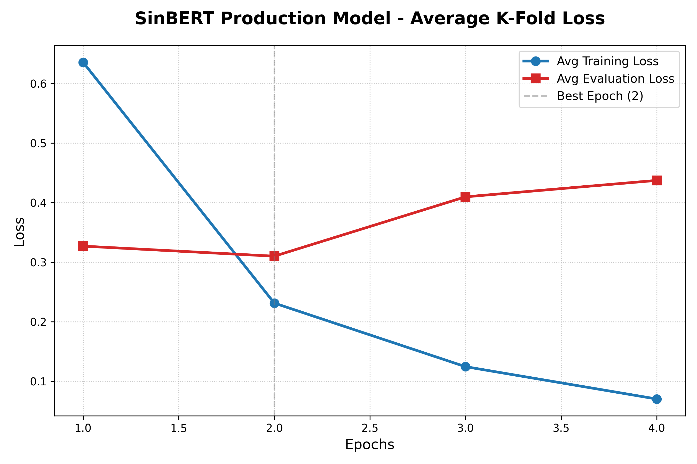</td>
    <td align="center"><strong>XLM-RoBERTa Production Model</strong><br>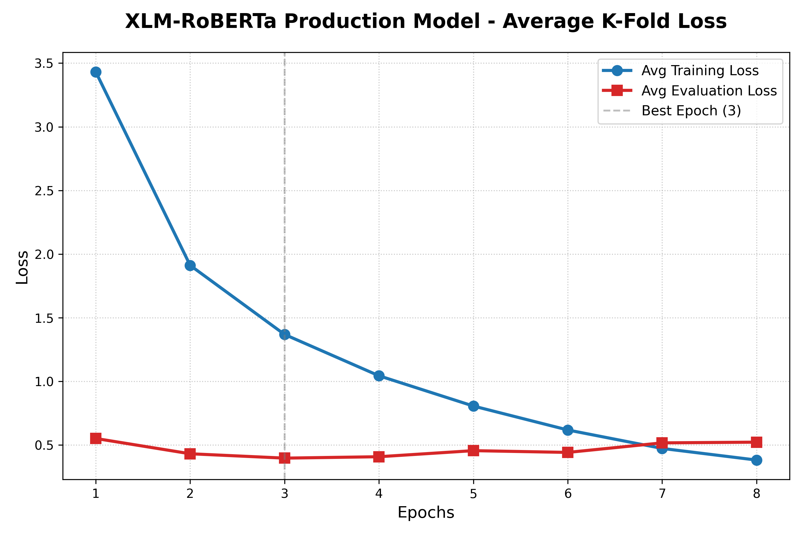</td>
  </tr>
</table>

### The "Memorization Trap"
A critical finding was SinLLaMA's failure to generalize. Despite 8B parameters and high training accuracy, it collapsed to **55.7% macro F1** on the held-out test set, while the lightweight encoders (SinBERT/XLM-R) learned more generalizable linguistic patterns. As training loss kept falling, evaluation loss plateaued and diverged — the classic signature of memorization rather than generalization. This is why checkpoints were selected by validation performance, not training loss.

<p align="center">
  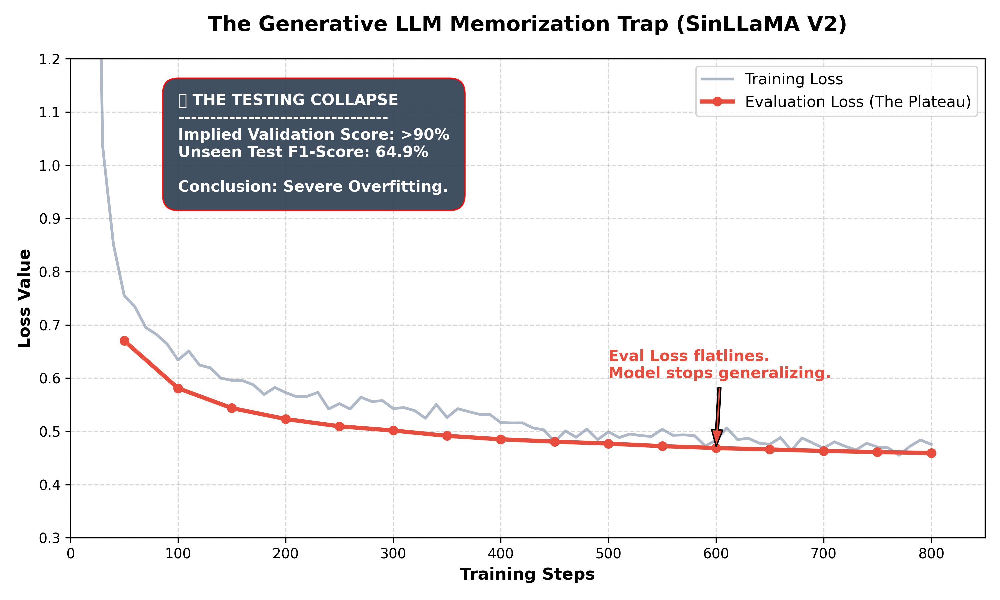
  <br>
  <em>Figure: Divergence between training and evaluation loss, indicating a collapse in generalization.</em>
</p>

---

## Conclusion
The final **SinhSafe Production Ensemble** uses **soft-voting (probability averaging)** between XLM-RoBERTa and SinBERT, reaching 76.21% macro F1. Statistically, this is **not significantly better** than standalone XLM-RoBERTa alone (75.44%, overlapping 95% CIs) — so for latency-sensitive deployments, a single well-tuned XLM-RoBERTa may be the more practical choice. Both clearly outperform traditional ML baselines and the generative SinLLaMA-8B model, while avoiding the compute overhead of large generative LLMs.

We recommend deploying standalone XLM-RoBERTa in a **human-in-the-loop pipeline**: it scores incoming content, low-confidence predictions are routed to human moderators rather than auto-actioned, and reviewed cases feed back into periodic retraining — improving accuracy and fairness over time.

---

## Additional / Ongoing Work: V2 Pseudo-Labeling Extension
*(Beyond the scope of this submission — included here as ongoing follow-up work, not part of the presented/evaluated results above.)*

To address data scarcity beyond the initial 6,075-document dataset, we deployed the three V1 production models (XLM-RoBERTa, SinBERT, SinLLaMA) on **145,000 unlabelled social media comments** and applied a strict extraction logic to build a larger V2 dataset:

1. **Direct Extraction:** Any label where at least one model had **>90% confidence**.
2. **Consensus Extraction:** Confidence between **80–90%** where XLM-R and SinBERT agreed.
3. **Manual Review:** Confidence between **40–80%** where all three models agreed; manually verified before inclusion.

This extended the Harassment class to 5,515 documents, producing a perfectly balanced **V2 corpus of 16,545 documents**.

| Model | Parameters | V1 Test Macro F1 | V2 F1-Score |
| :--- | :--- | :--- | :--- |
| SinBERT | ~110M | 73.44% | **90.7%** |
| XLM-R | ~550M | 75.44% | **86.9%** |
| SinLLaMA | ~8B | 55.7% | **64.9%** |

> **Note:** the V2 column's metric type and test set haven't been independently verified against the same macro-F1 / bootstrap-CI methodology used for the V1 results above — confirm whether V2 figures use macro F1 or a different metric (e.g. weighted F1/accuracy) before citing them alongside the V1 numbers, since they aren't directly comparable otherwise.

<table>
  <tr>
    <td align="center"><strong>V1 to V2 Performance Leap</strong><br>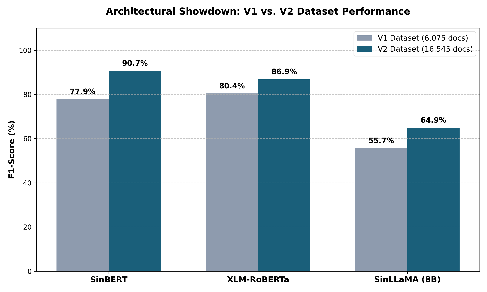</td>
  </tr>
</table>

This V2 work is presented as a promising extension for future publication, separate from the ternary classifier evaluated at the symposium.

---

## Project Demo
<p align="center">
  <video width="640" height="360" controls>
    <source src="images/demo.mp4" type="video/mp4">
    Your browser does not support the video tag.
  </video>
</p>

## Links
- [Project Repository](https://github.com/cepdnaclk/e20-4yp-SinhSafe)
- [Department of Computer Engineering](http://www.ce.pdn.ac.lk/)
