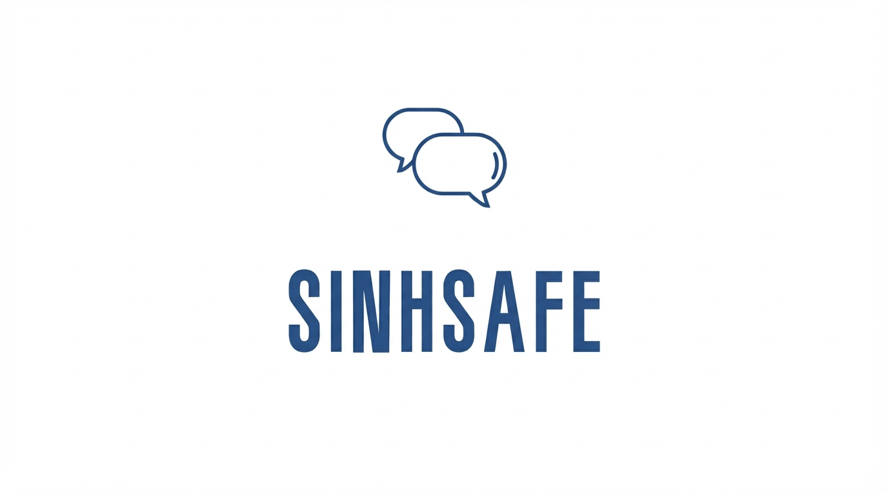

[comment]: # "This is the standard layout for the project, but you can clean this and use your own template"

# SinhSafe: Multi-Model Detection of Cyberbullying and Hate Speech

    

#### Team

- e20397, Thilakasiri P.D., [email](mailto:e20397@eng.pdn.ac.lk)

#### Supervisors

- Dr. Eng. Sampath Deegalla, [email](sampath@eng.pdn.ac.lk)

#### Table of content

1. [Abstract](#abstract)
2. [Related works](#related-works)
3. [Methodology](#methodology)
4. [Experiment Setup and Implementation](#experiment-setup-and-implementation)
5. [Results and Analysis](#results-and-analysis)
6. [Conclusion](#conclusion)
7. [Publications](#publications)
8. [Links](#links)

---

## Abstract

**SinhSafe** is an advanced abusive language detection framework specifically designed for the linguistic complexities of the Sinhala language and its code-mixed variant, Singlish. Addressing the critical gap in low-resource language safety tools, this project leverages state-of-the-art multilingual transformer models, specifically **XLM-RoBERTa (XLM-R)**, **SinBERT**, and **SinhLlama**, to classify social media content into three distinct categories: *Harassment*, *Offensive*, and *Normal*.

A key innovation of SinhSafe is its **3-Model Ensemble Pseudo-Labeling** pipeline, which is designed to generate a massive, high-quality corpus of ~65,000 documents from unlabelled data. By establishing a rigorous ground truth through Inter-Annotator Agreement and achieving a peak accuracy of **80.49%** in cross-validation, SinhSafe aims to provide nuanced content moderation solutions for Sri Lankan social media platforms, promoting safer online communities through AI-driven intervention.

## Related works

Research into Sinhala cyberbullying detection has been constrained by a lack of diverse datasets and resources, a challenge highlighted by **Viswanath & Kumar (2023)**. 

**Datasets & Classification Taxonomy**
Most existing work, such as the *SOLD* and *semi-SOLD* datasets by **Ranasinghe et al. (2022)**, focuses on binary classification (Offensive vs. Not Offensive). We identified that binary labels are often insufficient for nuanced moderation. Consequently, our project draws significant inspiration from **Mathew et al. (2021)** and their *HateXplain* dataset. Following their approach, we moved beyond binary detection to a **3-class taxonomy (Harassment, Offensive, Normal)**, allowing for more fine-grained analysis of harmful content.

**Model Architectures**
In the domain of model selection, **Dhananjaya et al. (2022)** demonstrated that monolingual models like **SinBERT** often outperform multilingual alternatives on small, specific Sinhala datasets. Conversely, the recent introduction of **SinLlama** by **Aravinda et al. (2025)** provides a foundation for testing Large Language Model (LLM) capabilities in Sinhala. SinhSafe benchmarks these distinct architectures (Multilingual XLM-R vs. Monolingual SinBERT vs. SinLlama) to determine the optimal approach.

## Methodology

The SinhSafe framework consists of three main stages:

1.  **Data Collection & Curation:** Aggregating a consolidated dataset from multiple sources and establishing a rigorous Ground Truth using **Manual Annotation** and **Inter-Annotator Agreement (Peer Review)**.
2.  **Taxonomy Definition (The "Umbrella" Approach):**
    * **Harassment:** An umbrella term covering both Cyberbullying and Hate Speech. It targets intent to harm, threats, and self-harm encouragement.
    * **Offensive:** General vulgarity, crude jokes, or profanity without malicious targeted intent.
    * **Normal:** Non-abusive content.
3.  **Hybrid Preprocessing Pipeline:**
    * **Google Transliteration API:** High-accuracy online transliteration for normalizing Singlish content into Sinhala script.
    * **Ensemble Strategy:** Using the consensus of XLM-R, SinLlama, and SinBERT to pseudo-label unlabelled data.

## Experiment Setup and Implementation

The models were trained using the Hugging Face `transformers` library on an NVIDIA RTX 3090 GPU. We utilized a custom classification head on the **XLM-RoBERTa Large** architecture to prevent overfitting:

* **Dense Layer:** A fully connected linear layer with **Tanh activation** to extract non-linear semantic features from the 1024-dimensional input vector.
* **Dropout Layer:** Implemented with a probability of 0.1 to randomly deactivate neurons during training. This "Anti-Misfit" mechanism forces the model to learn robust linguistic patterns rather than memorizing specific training examples.
* **Optimization:** AdamW optimizer with a learning rate of $2 \times 10^{-5}$ and a 500-step linear warmup.

## Results and Analysis

We validated our model using **5-Fold Stratified Cross-Validation** to ensure stability across different data splits. This rigorous testing confirmed that the model is robust to the linguistic variance found in social media comments.

**Phase 1 Results: XLM-RoBERTa (Large)**

| Metric | Result | Description |
| :--- | :--- | :--- |
| **Peak Accuracy** | **80.49%** | Achieved in Fold 3, representing the model's optimal performance capability. |
| **Average Accuracy** | **76.43%** | The mean accuracy across all 5 folds, proving high stability. |
| **Stability Insight** | **Epoch 3** | We observed that validation loss begins to diverge after Epoch 3, indicating the start of overfitting. Our final model uses early stopping to capture this optimal state. |

**Phase 2: Comparative Benchmarking (In Progress)**
Experiments are currently underway for **SinBERT** and **SinhLlama**. Once completed, their performance will be tabulated here to determine the most effective architecture for the final ensemble.

## Conclusion

SinhSafe successfully establishes a robust pipeline for Sinhala cyberbullying detection, moving beyond simple binary classification to a nuanced **Harassment vs. Offensive** taxonomy. Preliminary results with XLM-RoBERTa Large indicate that fine-grained classification in low-resource settings is highly achievable, with a peak accuracy of **80.49%**. The ongoing comparison with SinBERT and SinhLlama will provide a definitive benchmark for the research community, identifying the optimal model architecture for protecting the Sri Lankan digital ecosystem.

## Publications
[//]: # "Note: Uncomment each once you uploaded the files to the repository"

## Links

[//]: # ( NOTE: EDIT THIS LINKS WITH YOUR REPO DETAILS )

- [Project Repository](https://github.com/cepdnaclk/e20-4yp-SinhSafe)
- [Project Page](https://cepdnaclk.github.io/e20-4yp-SinhSafe)
- [Department of Computer Engineering](http://www.ce.pdn.ac.lk/)
- [University of Peradeniya](https://eng.pdn.ac.lk/)

[//]: # "Please refer this to learn more about Markdown syntax"
[//]: # "https://github.com/adam-p/markdown-here/wiki/Markdown-Cheatsheet"
